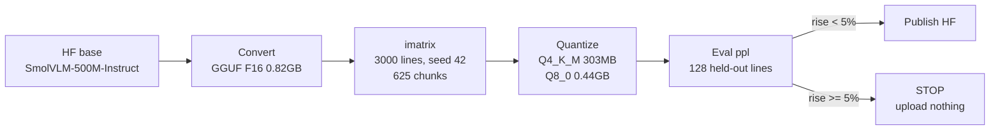
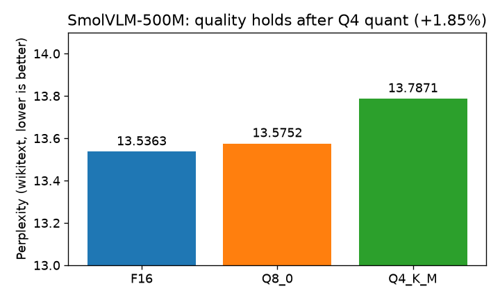
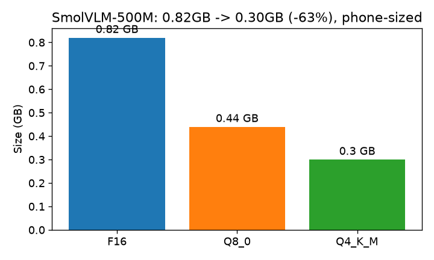

# SmolVLM-500M-Instruct GGUF — text-tower edge build

[](https://huggingface.co/ShayonSarker/SmolVLM-500M-Instruct-Q4_K_M-GGUF)
[](https://huggingface.co/HuggingFaceTB/SmolVLM-500M-Instruct)
[]()

SmolVLM-500M-Instruct squeezed to **303MB** via importance-matrix quant — **0.82GB → 0.30GB (−63%)** for **+1.85%** perplexity.

## Pipeline



## Results (measured on Kaggle T4 CPU)

| model | PPL ↓ | size | Δ vs F16 |
|---|---|---|---|
| F16 | 13.5363 | 0.82 GB | — |
| Q8_0 | 13.5752 | 0.44 GB | +0.29% |
| **Q4_K_M** | **13.7871** | **0.30 GB** | **+1.85%** ✅ |




## ⚠️ Scope: text tower only

This file holds **291 tensors (llama arch)** — the SigLIP vision encoder + mmproj are NOT included (verified: image input is rejected). It answers text prompts; it cannot see images. The PPL numbers above are valid for the text tower. A full multimodal build needs mmproj conversion — tracked as follow-up, not claimed here.

## Try it (text)

```
ollama create smolvlm-500m-q4 -f Modelfile
ollama run smolvlm-500m-q4 "Summarize photosynthesis in 2 lines."
```

## Reproduce (Kaggle T4, ~2h)

`SmolVLM-GGUF-Pipeline.ipynb` in this repo — upload to Kaggle, attach `HF_TOKEN`, Run All.

## Honest limitations

* **No vision in this file** — see scope note. Do not evaluate it on image tasks.
* **Perplexity-only validation** — no task evals.
* **English wikitext calibration** — other languages/domains may vary.
* SmolVLM quants already exist upstream (ggml-org) — this one's edge is measured eval + repro.

## Repo contents

| file | what |
|---|---|
| `SmolVLM-GGUF-Pipeline.ipynb` | full pipeline (this run) |
| `Modelfile` | Ollama build |
| `REPRO.json` / `SHA256.txt` | proof: numbers + hashes (from HF) |
| `ppl.png` / `size.png` | charts above, generated from measured numbers |

Model weights live on 🤗 [ShayonSarker/SmolVLM-500M-Instruct-Q4_K_M-GGUF](https://huggingface.co/ShayonSarker/SmolVLM-500M-Instruct-Q4_K_M-GGUF) (kept out of git).
